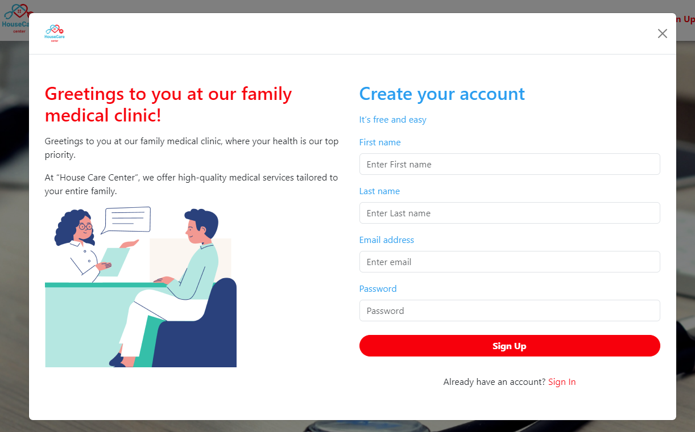
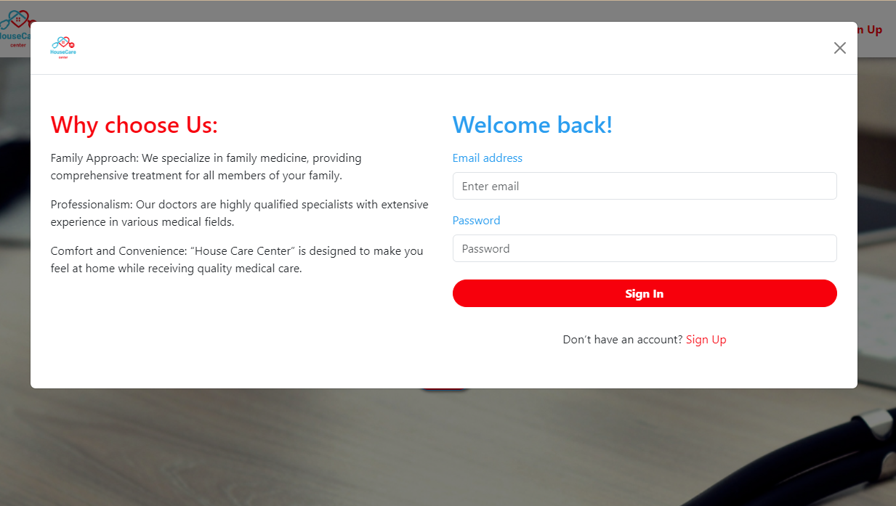

# Doctor Appointment App (Educational Project)

## Frontend

- React
- Redux
- TypeScript

## Backend

- Java
- Spring
- MySQL

[https://github.com/alexlead/doctor_appointment_app](backend_repository_link)

## Description

Doctor Appointment is a web application developed for educational purposes to provide students with a platform for practicing their skills and gaining real-world experience. The project offers an opportunity to learn and apply various technologies, including React, Redux, TypeScript, Java, Spring, and MySQL.

## Usage

1. Make sure you have Node.js for the frontend, and Java, Spring, and MySQL for the backend.
2. Clone the repository for both frontend and backend.
3. Install dependencies for both projects.
4. Start the server and the application.
5. For the frontend, install dependencies by running `npm install`.
4. For the frontend, start the application by running `npm start`.

## Feedback and Questions

If you have any questions or need assistance, please [https://github.com/alexlead/doctor_appointment_app/issues](issues_link) in this repository. We're here to help you learn and develop!

## License

This project is intended for educational and non-commercial use. You are free to study, modify, and use the code of the project within these conditions. Please note that the absence of a specific license does not imply the absence of all rights and restrictions. For more information on using the code, please contact the project authors.

